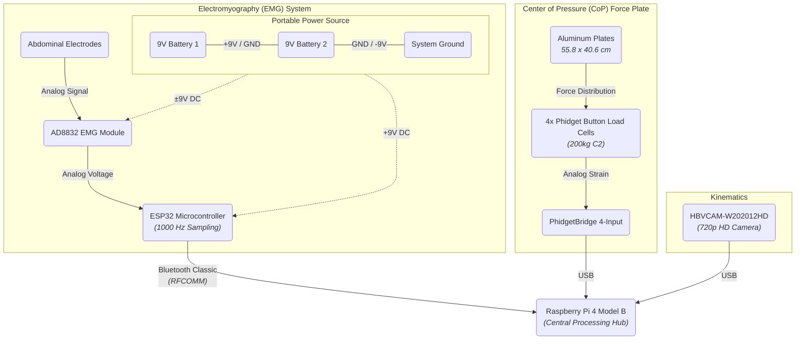

# Hardware Specifications

This document outlines the physical components, sensors, and structural setup utilized in the Real-Time CoP, Joint Angle, and EMG Acquisition System.

---

## System Architecture Diagram

The following diagram illustrates the hardware communication pathways and power supply arrangement for the complete multimodal acquisition system:

---

## 1. Central Processing
* **Host Device:** Raspberry Pi 4 Model B
* **Role:** Acts as the central hub, executing the Python data acquisition software, processing computer vision models, and receiving synchronized data streams via USB and Bluetooth.

---

## 2. Electromyography (EMG) System
The EMG acquisition is a portable, wireless unit that transmits raw analog voltages to the host over Bluetooth Classic.

* **Sensor Module:** AD8832 EMG Module (Dimensions: 1.13" x 1"). The module utilizes 5 output connections: ±9V DC for power, GND, and the analog signal output.
* **Electrodes:** Standard disposable electrodes connected via an integrated 3.5 mm audio jack. They are placed on the abdominal region (targeting muscles such as the Transversus Abdominis) to evaluate intra-abdominal pressure (PIA) and core stability.
* **Microcontroller:** ESP32 (Configured with custom firmware for precise 1000 Hz hardware-timed analog sampling).
* **Power Supply:** A dual 9V battery arrangement connected in series provides a bipolar ±9V DC supply (+9V, GND, -9V) to properly power the AD8832 module. The ESP32 is powered from this 9V source.
* **Enclosure:** The entire wireless EMG circuit is securely housed in a compact 4.8 x 9.9 x 6.6 cm³ plastic casing to guarantee portability and protect the connections.

---

## 3. Center of Pressure (CoP) Force Plate
A custom-built force plate constructed to accurately calculate the subject's Center of Pressure.

* **Structural Dimensions:** Two aluminum plates with an overall surface area of 55.84 cm (width) x 40.64 cm (height).
* **Load Cells:** 4 x Phidget Button Load Cell (SKU: 3136_0 / Accuracy Class: C2)
  * Capacity: 200 kg per cell (800 kg total system capacity).
  * Rated Output: 1 mV/V.
* **Bridge Controller:** PhidgetBridge 4-Input (SKU: 1046_1)
  * Resolution: 24-bit differential voltage resolution.
  * Interface: USB connection directly to the Raspberry Pi.

---

## 4. Kinematics (Optical Sensor)
* **Camera Module:** HBVCAM-W202012HD V33 (USB Plug-and-Play)
* **Sensor Details:** OV9726 (1/6 inch sensor)
* **Resolution:** 1 Megapixel (1280x720 HD)
* **Field of View (FOV):** 70°
* **Role:** Captures real-time human movement, which is processed by the CPU-optimized MediaPipe framework to extract skeletal joint angles.
